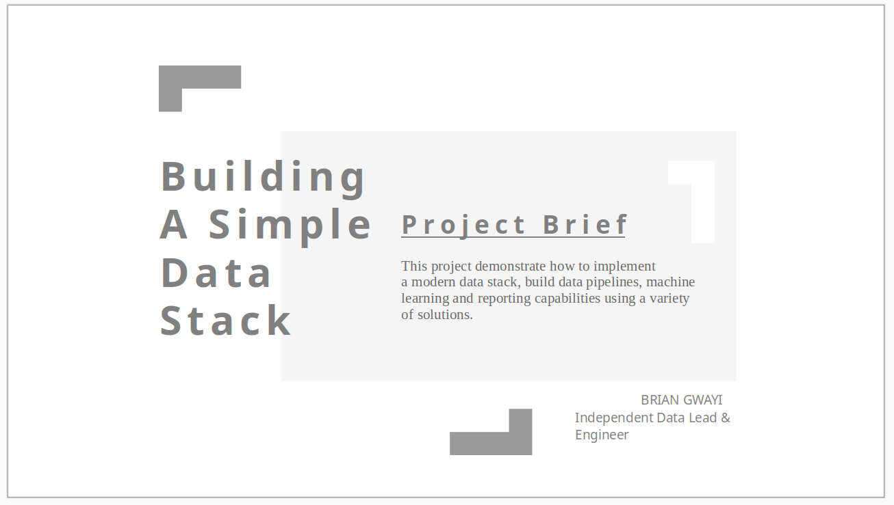
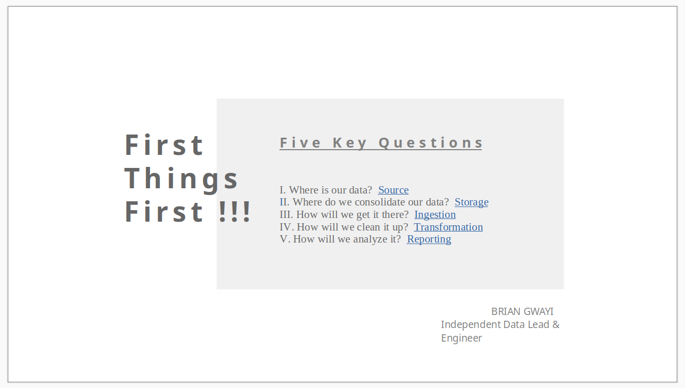
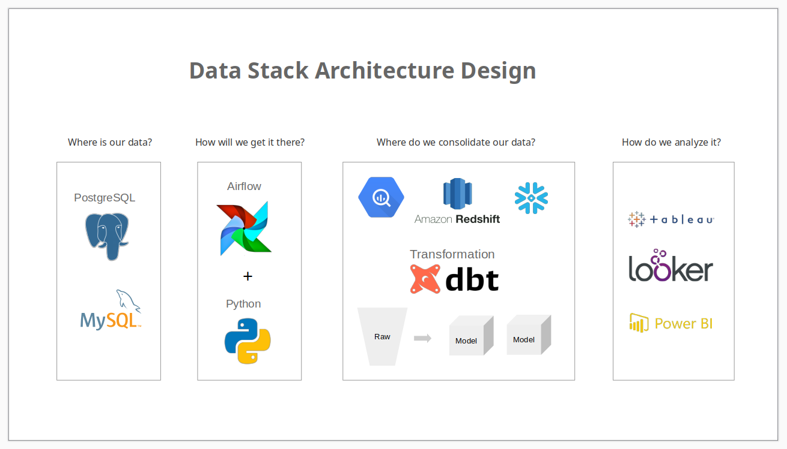

## Projects  
**1. Storage/Data Warehouse**  
Implementing Data Warehouse Solutions   
Google [BigQuery](https://cloud.google.com/bigquery/docs/sandbox) | [Snowflake](https://docs.snowflake.com/en/user-guide-getting-started) | AWS [Redshift](https://aws.amazon.com/redshift/getting-started/) | AWS [s3](https://docs.aws.amazon.com/AmazonS3/latest/userguide/GetStartedWithS3.html) | Oracle [ADW](https://apexapps.oracle.com/pls/apex/f?p=44785:50:6507125748187:::50:P50_COURSE_ID,P50_EVENT_ID:251,5925)   

**2. Ingestion**  
Developing Data Pipelines  
[Airflow](https://github.com/BrianGwayi/portfolio/blob/main/Airflow/etl.py) | [Airbyte]() | [dagster]() | [Prefect]()   

```
python3 -m venv prefect_env   
source prefect_env/bin/activate   
pip install -U prefect   
prefect --version    
prefect version    
prefect server start``

**3. Transformation**  
Setting up dbt [Getting Started]()   
Building Models  

**4. Reporting**   
[Looker]() | [Tableau]() | [Power BI]()  

**5. Machine Learning**   
Building ML Models  

