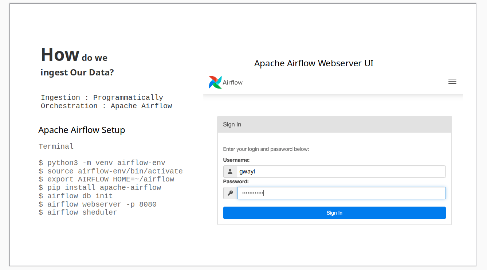
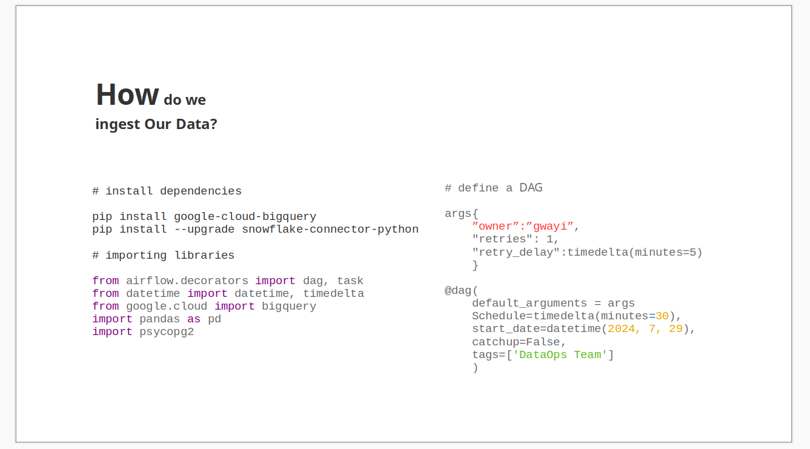
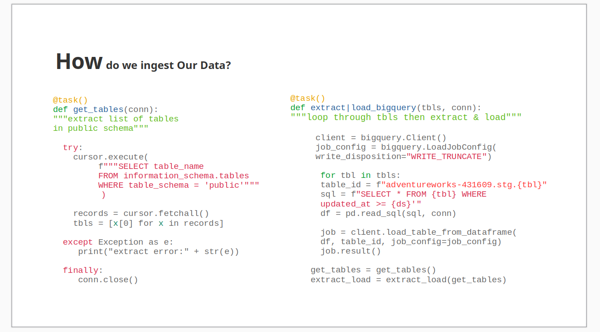
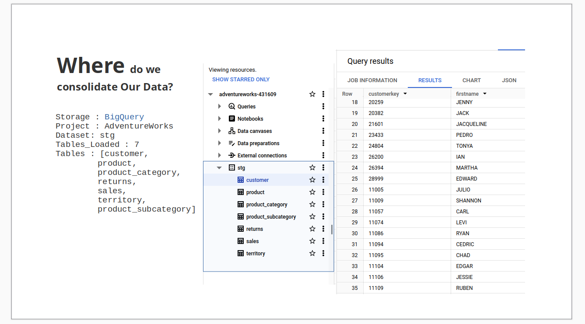

   

## Projects  
**1. Storage/Data Warehouse**  
Implementing Data Warehouse Solutions   
Google [BigQuery](https://cloud.google.com/bigquery/docs/sandbox) | [Snowflake](https://docs.snowflake.com/en/user-guide-getting-started) | AWS [Redshift](https://aws.amazon.com/redshift/getting-started/) | AWS [s3](https://docs.aws.amazon.com/AmazonS3/latest/userguide/GetStartedWithS3.html) | Oracle [ADW](https://apexapps.oracle.com/pls/apex/f?p=44785:50:6507125748187:::50:P50_COURSE_ID,P50_EVENT_ID:251,5925)   

**2. Ingestion**  
Developing Data Pipelines  
[Airflow](https://github.com/BrianGwayi/portfolio/blob/main/Airflow/etl.py) | [Airbyte]() | [dagster]() | [Prefect]()   

**3. Transformation**  
Setting up dbt [Getting Started]()   
Building Models  

**4. Reporting**   
[Looker]() | [Tableau]() | [Power BI]()  

**5. Machine Learning**   
Building ML Models  
## Where is Our Data?
## Basic Set ups 

**Prefect Setup**
```
$ python3 -m venv prefect_env   
$ source prefect_env/bin/activate   
$ pip install -U prefect   
$ prefect --version    
$ prefect version    
$ prefect server start
```
**Dagster Setup**
```
$ python3 -m venv dagster_env   
$ source dagster/bin/activate   
$ pip install dagster
$ pip install -e ".[dev]"
$ dagster dev   
```
**Airflow Setup**
```
$ python3 -m venv airflow-env   
$ source airflow-env/bin/activate   
$ export AIRFLOW_HOME=~/airflow
$ pip install apache-airflow
$ airflow db init
$ airflow webserver -p 8080
$ airflow sheduler   
```
**dbt**
```
$ python3 -m venv dbt-env   
$ source dbt-env/bin/activate   
$ python -m pip install dbt-core dbt-ADAPTER_NAME
```

